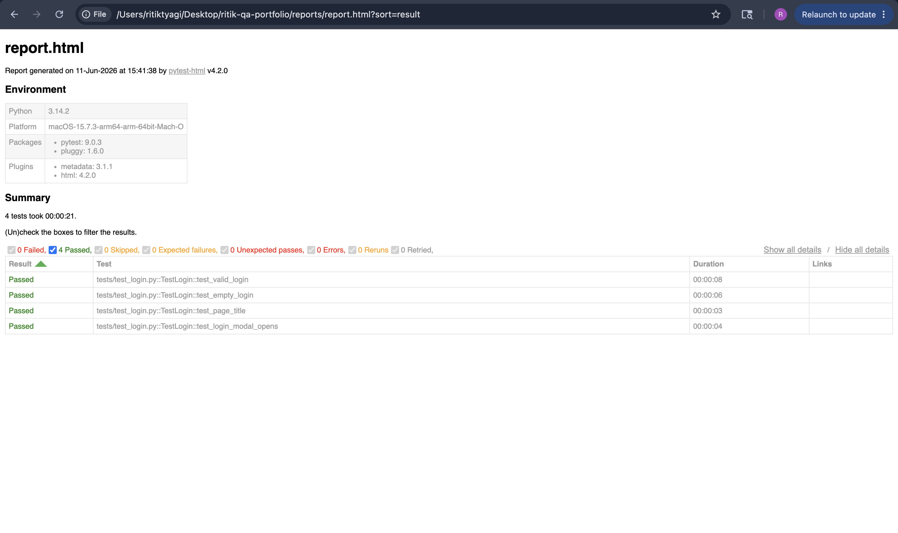

# QA Automation Portfolio — Ritik Tyagi

Automated test suite built with Selenium WebDriver + Python + pytest.
Follows Page Object Model (POM) design pattern.

## Test Results

## Tech Stack
- Python 3.x
- Selenium WebDriver 4.x
- pytest + pytest-html
- webdriver-manager
- Page Object Model (POM)

## Project Structure
ritik-qa-portfolio/
├── pages/
│   ├── base_page.py       # Reusable base class for all pages
├── tests/
│   ├── test_login.py      # Login flow tests
│   ├── test_locators.py   # All 8 locator practice tests
├── conftest.py            # pytest fixtures - browser setup/teardown
├── requirements.txt       # Project dependencies
└── README.md

## Test Coverage
- Login: valid credentials, empty fields, modal opens
- Locators: all 8 Selenium locator strategies demonstrated

## How to Run

Install dependencies
pip install -r requirements.txt

Run all tests
pytest tests/ -v

Run with HTML report
pytest tests/ -v --html=reports/report.html --self-contained-html

## Test Results

## Author
Ritik Tyagi — QA Engineer | 2+ years SaaS experience
LinkedIn: linkedin.com/in/ritiktyagi979